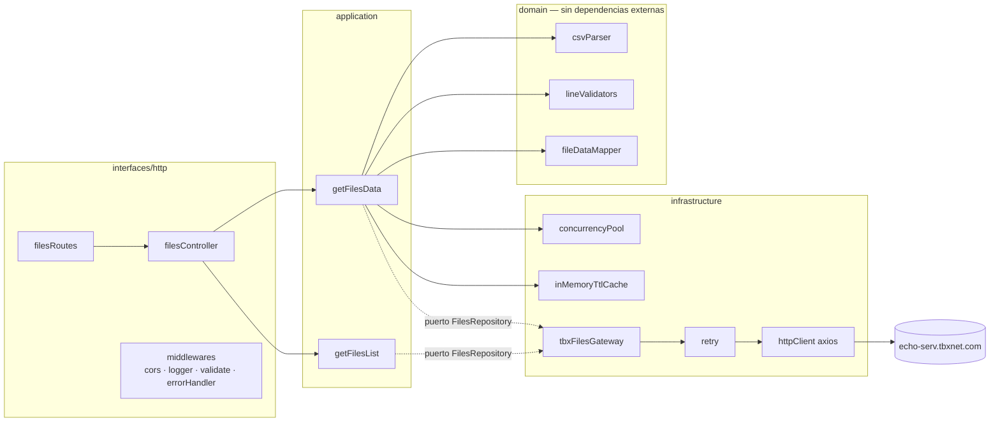

# tbx-files-api

API REST en Node.js + Express que agrega archivos CSV publicados por un proveedor externo inestable (`echo-serv.tbxnet.com`), descarta las líneas malformadas y expone los datos ya normalizados en un contrato JSON estable.

## 1. Cómo levantar el proyecto

### Con npm

```bash
npm install
npm start
```

El servidor arranca en `http://localhost:3000` sin necesidad de definir ninguna variable de entorno. Todos los valores de `src/config/index.js` tienen un default funcional; las variables de entorno (`PORT`, `TBX_BASE_URL`, `TBX_AUTH_TOKEN`, `TBX_TIMEOUT_MS`, `TBX_CONCURRENCY`, `TBX_CACHE_TTL_MS`, `TBX_VALIDATION_STRATEGY`) son overrides opcionales, nunca requisitos de arranque.

### Con Docker

```bash
docker build -t tbx-files-api .
docker run -p 3000:3000 tbx-files-api
```

La imagen es multi-stage sobre `node:14-alpine`, corre como usuario no-root y expone un `HEALTHCHECK` contra `GET /health`.

### Tests

```bash
npm test        # Mocha + Chai + Nock, no requiere red
npm run coverage # el mismo suite con reporte de cobertura (nyc)
npm run lint     # StandardJS
```

## 2. Arquitectura

Arquitectura hexagonal ligera. La regla de dependencia es `interfaces → application → domain`; `application` depende de un puerto documentado con JSDoc (`FilesRepository`), nunca de la implementación concreta, y `domain` no importa ni Express ni Axios.



**Por qué esta forma:** el proveedor externo es el punto inestable del sistema, así que se aísla detrás de un adapter (`tbxFilesGateway`) que es la única pieza que conoce su URL, su formato de respuesta y su autenticación. El caso de uso (`getFilesData`) no sabe que existe Axios ni HTTP: recibe un `FilesRepository` por inyección (factory function, sin contenedor de DI) y coordina dominio puro (parseo, validación, mapeo) con infraestructura (pool de concurrencia, cache, retry). Esto hace que el dominio se pueda testear con Mocha puro, sin red y sin mocks de HTTP.

## 3. Decisiones y trade-offs

- **Archivos vacíos vs. archivos que fallan.** Un archivo que se descarga correctamente pero no contiene ninguna línea válida se incluye en la respuesta con `lines: []`. Solo se omiten (y cuentan en `X-Skipped-Files`) los archivos cuya *descarga* falla. Son dos fallos semánticamente distintos: uno es "el proveedor no me dio el archivo", el otro es "el archivo no tenía datos útiles".
- **Rigor de validación configurable.** `lineValidators` implementa dos estrategias con Strategy pattern: `strictColumnCount` (default, activa) exige exactamente 4 columnas sin ningún campo vacío — es la lectura literal del enunciado ("líneas que no tengan la cantidad de datos suficiente"). `strictTypes` además exige que `number` sea un entero y `hex` tenga 32 caracteres hexadecimales; está implementada y testeada pero desactivada por defecto, activable con `TBX_VALIDATION_STRATEGY=strictTypes`. Se dejó fuera por defecto porque el enunciado habla de "cantidad de datos", no de tipos, y activar tipado estricto por defecto descartaría silenciosamente filas que sí cumplen el contrato explícito.
- **404 vs. array vacío.** Si `fileName` no está en el listado del proveedor, se responde `404 FILE_NOT_FOUND`: el cliente pidió algo que no existe, y devolver `200 []` ocultaría ese error. Si `fileName` existe pero su descarga falla, se responde `502 UPSTREAM_ERROR` — la omisión silenciosa del listado completo (`X-Skipped-Files`) no aplica aquí porque el cliente pidió ese archivo puntual.
- **Orden preservado bajo concurrencia.** El pool de concurrencia (`concurrencyPool.js`) escribe cada resultado en un array pre-dimensionado, indexado por la posición original del archivo en el listado del proveedor. El orden de finalización de las promesas no afecta el orden del array de salida.
- **`X-Skipped-Files` en el header, nunca en el body.** El contrato de `/files/data` es un array plano en la raíz; meter metadata ahí adentro (como `{ data: [...], skipped: n }`) rompería esa forma. CORS se configura con `exposedHeaders: ['X-Skipped-Files']` porque, por spec, el navegador solo expone 7 headers "simples" por defecto — sin este ajuste el frontend recibiría `undefined` al leer el header.
- **Cache-aside por archivo, no por listado.** Se cachea el resultado ya parseado de cada archivo (TTL 60 s) porque el costo caro es la descarga + parseo, no el listado en sí. El listado (`GET /files/list` interno) se pide fresco en cada request: es una lista de nombres, barata, y cachearla introduciría una ventana en la que un archivo nuevo en el proveedor tardaría hasta 60 s en aparecer.
- **Bulkhead con límite 5, propio, sin `p-limit`.** `p-limit` v4+ es ESM-only y rompe en Node 14 con `require`. El pool propio (`concurrencyPool.js`) tiene ~25 líneas y usa el patrón de "carriles" (lanes): N workers async que van tomando el siguiente índice disponible hasta agotar la lista.
- **Retry solo en fallos transitorios.** `retry.js` reintenta únicamente 5xx, timeouts y `ECONNRESET`/`ECONNABORTED`/`ETIMEDOUT` — nunca 4xx, porque un 4xx significa que la petición está mal formada y reintentarla solo repite el mismo error. 2 reintentos con backoff exponencial (`300ms × 2ⁿ` + jitter aleatorio) para no sincronizar reintentos en ráfaga contra un proveedor ya inestable.

## 4. Contrato del API

### `GET /files/data`

Devuelve `200 application/json` con un array plano en la raíz. Los archivos que fallan al descargar se omiten (la respuesta sigue siendo `200`); el conteo de omitidos va en el header `X-Skipped-Files`.

```
GET /files/data
```

```json
[
  {
    "file": "test1.csv",
    "lines": [
      { "text": "RgTya", "number": 64075909, "hex": "70ad29aacf0b690b0467fe2b2767f765" }
    ]
  },
  {
    "file": "test2.csv",
    "lines": []
  }
]
```

Headers de respuesta relevantes: `Content-Type: application/json`, `X-Skipped-Files: 1`, `Access-Control-Expose-Headers: X-Skipped-Files`.

### `GET /files/data?fileName=test1.csv`

Mismo formato, array con un único elemento.

- `fileName` no existe en el listado del proveedor → `404 FILE_NOT_FOUND`.
- `fileName` existe pero su descarga falla → `502 UPSTREAM_ERROR` (no se aplica omisión silenciosa).
- `fileName` vacío o con formato inválido (path traversal, etc.) → `400 INVALID_QUERY`.

### `GET /files/list`

```json
{ "files": ["test1.csv", "test2.csv"] }
```

### `GET /health`

```json
{ "status": "ok", "uptime": 123.4 }
```

### Errores

Cuerpo uniforme en todos los casos:

```json
{ "error": { "code": "FILE_NOT_FOUND", "message": "File 'x.csv' was not found" } }
```

| Situación | Status | `code` |
|---|---|---|
| `fileName` inexistente | 404 | `FILE_NOT_FOUND` |
| `fileName` con formato inválido (vacío, path traversal) | 400 | `INVALID_QUERY` |
| El listado del proveedor falla | 502 | `UPSTREAM_ERROR` |
| Cualquier otro fallo no controlado | 500 | `INTERNAL_ERROR` |

## 5. Cobertura y tests

```
npm run coverage
```

Última medición: **99.5% de statements / 100% de funciones y líneas** con `nyc` (umbral pedido: 80%). El único gap real está en un branch defensivo de `retry.js` que nunca se ejercita porque la suite fija `attempts` explícitamente en cada test.

La suite corre íntegramente offline: `nock.disableNetConnect()` en `test/setup.js` hace fallar de inmediato cualquier request que se escape del mock, así que un `npm test` sin conexión a internet es determinista.

- **Unitarios** (`test/unit`): `csvParser`, `lineValidators`, `fileDataMapper`, `retry`, `concurrencyPool`, `inMemoryTtlCache`, `tbxFilesGateway` (con Nock), `getFilesData`/`getFilesList` (con un repositorio doble en memoria), `errorHandler`.
- **Integración** (`test/integration`, Supertest + Nock): los endpoints reales sobre la app de Express, incluyendo el caso de omisión parcial, los tres códigos de error y el header CORS.

## 6. Métricas de rendimiento

Medidas contra el proveedor real (`echo-serv.tbxnet.com`, 9 archivos en el listado durante la medición), en una máquina de desarrollo, promedio de 3 corridas por escenario. El proveedor introduce fallos 5xx intermitentes a propósito, así que hay varianza entre corridas por los reintentos.

| Escenario | Tiempo (promedio) |
|---|---|
| Secuencial (`TBX_CONCURRENCY=1`), listado completo, en frío | ~2.02 s |
| Concurrencia 5 (default), listado completo, en frío | ~1.94 s |
| Un único archivo (`?fileName=`), en frío | 0.37 s |
| El mismo archivo, con caché caliente (TTL 60 s) | 0.09 s (-76%) |

Con solo 9 archivos y un round-trip individual de ~0.2 s, la ganancia de la concurrencia 5 frente a la secuencial queda parcialmente enmascarada por los reintentos del proveedor (que añaden 300 ms–2 s de golpe a una request puntual, sin importar el modo). El efecto de la concurrencia se vuelve más determinante cuantos más archivos haya en el listado, porque el costo secuencial escala linealmente (`n × latencia`) mientras que el costo concurrente escala con `⌈n / 5⌉ × latencia`. Donde sí se ve un salto claro y estable es en la caché: pedir el mismo archivo dos veces dentro del TTL evita por completo la descarga y el parseo.

## 7. Qué haría con más tiempo

- Autenticación en el propio API (API keys o JWT) si fuera a exponerse fuera de un entorno de prueba.
- Paginación en `/files/data` para catálogos grandes, en vez de devolver todo el array en una sola respuesta.
- Streaming del CSV (parseo por chunks) en vez de cargar el archivo completo en memoria antes de parsearlo.
- Métricas (latencia por endpoint, tasa de reintentos, hit rate de caché) expuestas en un endpoint `/metrics` compatible con Prometheus.
- Pipeline de CI que corra `npm test`, `npm run lint` y `npm run coverage` en cada PR, y publique la imagen Docker.
